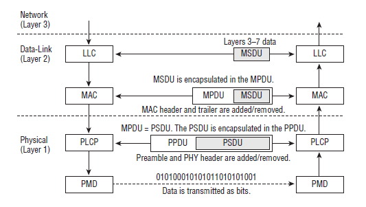
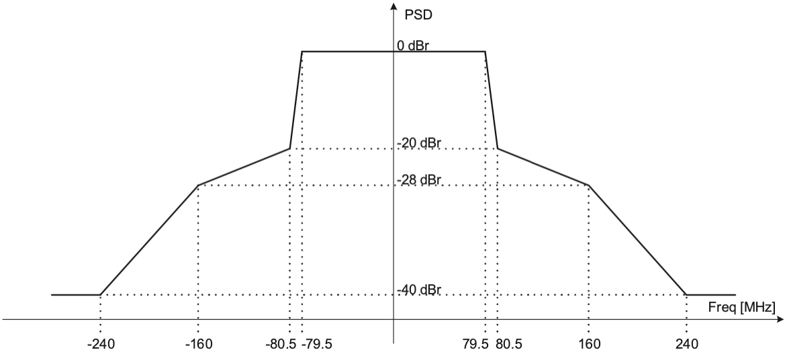
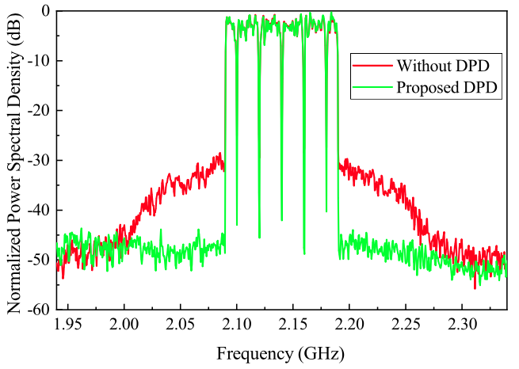
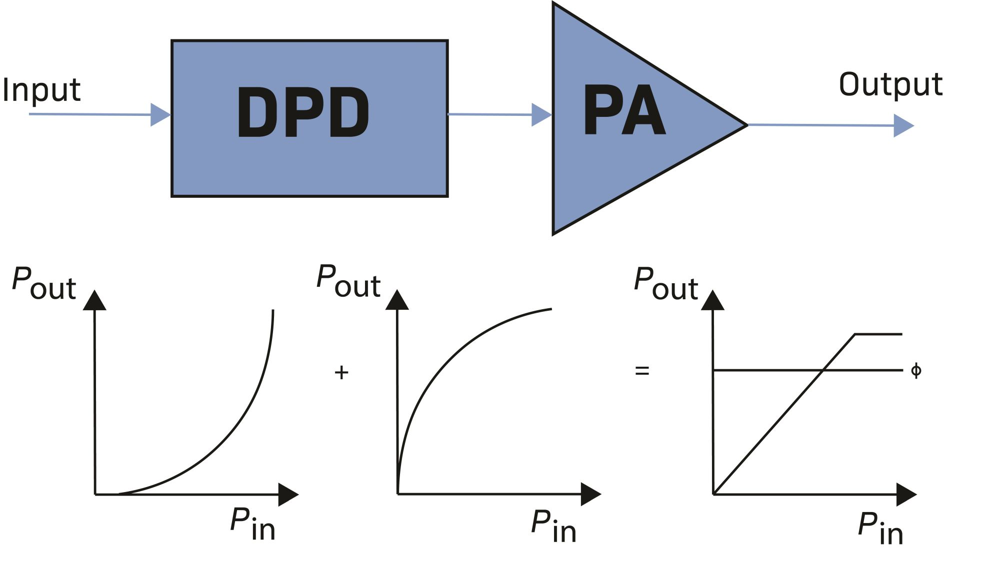
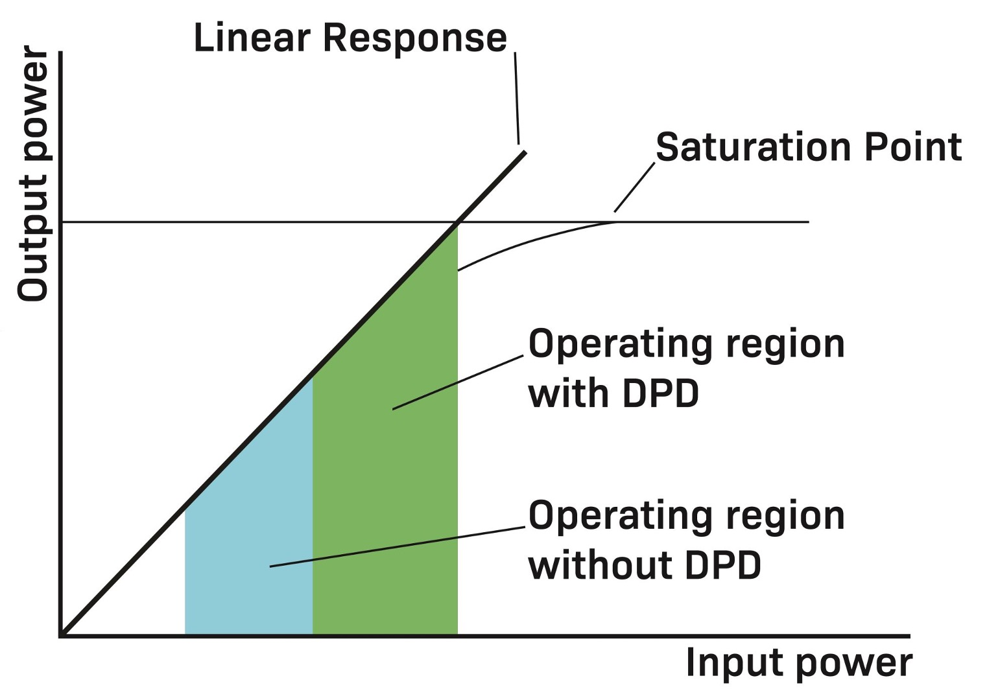
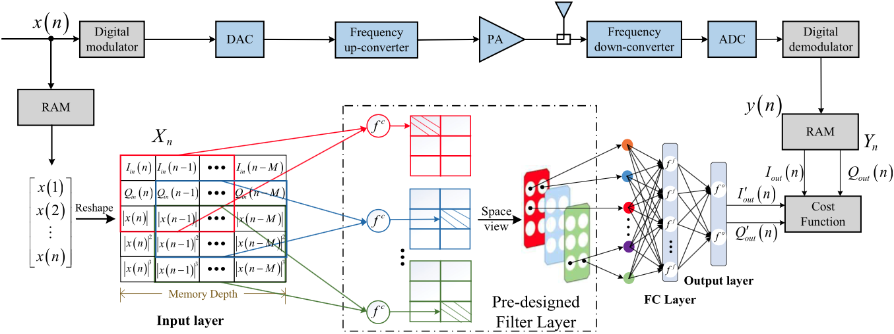

# AI DPD

## RF

Wi-Fi, MAC and PHY

## PA purpose

- **Boost the signal power:** Increase the amplitude of the radio frequency (RF) signal to a level sufficient for transmission over long distances.

- **Ensure signal integrity:** Maintain the quality of the signal while amplifying it, minimizing distortion and noise.

PAs are crucial components in wireless communication systems. They amplify the signal before transmission to ensure it reaches the receiver with adequate strength.

However, PAs are inherently nonlinear, especially when operating at high power levels close to saturation, which leads to signal distortion.

## PSD

Example transmit spectral mask for a 160 MHz PPDU

## Nonlinear Distortion

When a PA operates in its linear region, the output signal is a scaled version of the input signal. However, as the power level increases, the PA moves into its nonlinear region, causing:

- Amplitude distortion (AM-AM distortion): The amplitude of the output signal is not linearly proportional to the input amplitude.

- Phase distortion (AM-PM distortion): The phase of the output signal deviates from the input phase.

- Spectral regrowth: Nonlinearities generate unwanted frequency components outside the desired bandwidth, causing adjacent channel interference (ACI).

Consequences of PA Nonlinearities

- In-band distortion: Degrades signal quality, increasing error vector magnitude (EVM).

- Out-of-band emissions: Violates regulatory spectral masks and causes interference to adjacent channels.

- Reduced efficiency: Designers may operate PAs at backoff (lower power levels) to maintain linearity, but this significantly reduces power efficiency.

## DPD

Due to their nonlinear nature, PAs introduce distortions in transmitted signals, necessitating **digital predistortion (DPD)** techniques to compensate for these effects.

### Linearization

Linearization performance of the PA at a 100-MHz LTE signal.

*X. Hu et al., "Convolutional Neural Network for Behavioral Modeling and Predistortion of Wideband Power Amplifiers," in IEEE Transactions on Neural Networks and Learning Systems, vol. 33, no. 8, pp. 3923-3937, Aug. 2022, doi: 10.1109/TNNLS.2021.3054867.*

Block diagram of a DPD system shows how it linearizes the PA.

### Saturation

DPD moves a PA’s operating region closer to its saturation point.

<https://www.5gtechnologyworld.com/how-dpd-improves-power-amplifier-efficiency/>

## DPD learning

In Digital Pre-Distortion (DPD), learning algorithms are used to adaptively correct the nonlinear distortions introduced by power amplifiers (PAs).

There are **2 main** approaches:

  1. Direct Learning Architecture (DLA)

        **How It Works:**

          - The system directly extracts the inverse model of the power amplifier (PA) based on the observed output.

          - It compares the PA’s output with the desired input signal and adjusts the pre-distorter coefficients accordingly.

          - A closed-loop adaptation process continuously refines the pre-distortion model to minimize errors.

        **Advantages:**

            ✔ Faster convergence since it directly estimates the inverse PA model.

            ✔ More accurate correction for complex, memory-intensive nonlinearities.

            ✔ Works well in real-time applications.

        **Disadvantages:**

            ✖ Requires real-time feedback and powerful processing to update the model dynamically.

            ✖ Can be more computationally expensive compared to indirect learning.

  2. Indirect Learning Architecture (ILA)

        **How It Works:**

       - The system first estimates the PA’s behavior by capturing its output.

       - Then, it trains an inverse model offline based on this data.

       - Finally, the trained model is used for pre-distortion.

        **Advantages:**

            ✔ Easier to implement because it does not require real-time adaptation.
            ✔ Lower computational complexity compared to direct learning.

        **Disadvantages:**

            ✖ Slower adaptation because it relies on periodic updates instead of real-time feedback.
        
            ✖ May not respond well to time-varying changes (e.g., temperature fluctuations).

## **Mathematical Explanation of Direct and Indirect Learning in Digital Pre-Distortion (DPD)**

## **1. Introduction**

Digital Pre-Distortion (DPD) is used to correct the nonlinearities of Power Amplifiers (PAs) in wireless communication systems. Two main approaches exist:

- **Indirect Learning Architecture (ILA)**: Learns the inverse model offline and applies it statically.
- **Direct Learning Architecture (DLA)**: Updates the pre-distorter adaptively in real-time using feedback.

---

## **2. Indirect Learning Architecture (ILA)**

ILA estimates the PA’s behavior and then derives an inverse function to compensate for its distortions. This inverse function is applied to future input signals.

### ILA Mathematical Formulation

1. **Power Amplifier Model** (Nonlinear System Representation):
    $$
    y(n) = f_{\text{PA}}(x(n))
    $$
   where:
   - $x(n)$ is the input signal,
   - $y(n)$ is the output signal,
   - $f_{\text{PA}}$ represents the nonlinear function of the PA.

2. **Finding the Inverse Model**:
   The DPD function should satisfy:
   $$
   x(n) = f_{\text{DPD}}(y(n))
   $$
   where $f_{\text{DPD}}$ is the inverse function applied to the PA output to recover the original signal.

3. **Applying the Pre-Distortion**:
   $$
   x_{\text{PD}}(n) = f_{\text{DPD}}(x(n))
   $$
   where $x_{\text{PD}}(n)$ is the pre-distorted input that compensates for PA nonlinearities.

### **Estimation Methods:**

- **Memory Polynomial Model**:
  $$
  y(n) = \sum_{k=0}^{K} \sum_{m=0}^{M} a_{k,m} x(n-k) |x(n-k)|^m
  $$
  where $a_{k,m}$ are polynomial coefficients.

- **Volterra Series Expansion** (General Nonlinear Model):
  $$
  y(n) = \sum_{p=1}^{P} \sum_{m_1,...,m_p} h_p(m_1,...,m_p) \prod_{i=1}^{p} x(n-m_i)
  $$
  where $h_p(m_1,...,m_p)$ are kernel coefficients.

---

## **3. Direct Learning Architecture (DLA)**

DLA updates the pre-distortion function dynamically by minimizing the error between the desired and actual output.

### DLA Mathematical Formulation**

1. **Define the Error Function:**
   $$
   e(n) = x(n) - y(n)
   $$
   where $e(n)$ is the difference between the desired input $x(n)$ and the actual output $y(n)$.

2. **Gradient-Based Optimization:**
   The DPD coefficients are updated using:
   $$
   w_{k+1} = w_k - \mu \cdot \nabla E
   $$
   where:
   - $w_k$ are the DPD coefficients at iteration \( k \),
   - $\mu$ is the step size (learning rate),
   - $\nabla$ is the gradient of the error function.

3. **Adaptive Pre-Distortion Update:**
   $$
   x_{\text{PD}}(n) = f_{\text{DPD}}(x(n), w_k)
   $$
   where $w_k$ is continuously updated using LMS or RLS algorithms.

### **Adaptive Learning Algorithms:**

- **Least Mean Squares (LMS):**
  $$
  w_{k+1} = w_k + \mu e(n) x(n)
  $$
- **Recursive Least Squares (RLS):**
  $$
  w_{k+1} = w_k + P_k x(n) e(n)
  $$
  where $P_k$ is the inverse correlation matrix.

---

## **4. Comparison of DLA vs. ILA**

| Feature          | Indirect Learning (ILA) | Direct Learning (DLA) |
|-----------------|----------------------|----------------------|
| Learning Type | Offline (batch) | Online (real-time) |
| Model Estimation | Estimates inverse PA model | Directly minimizes error |
| Computational Cost | Lower | Higher (adaptive feedback required) |
| Adaptability | Low (fixed model) | High (continuous adaptation) |
| Feedback Requirement | No real-time feedback | Real-time feedback needed |
| Convergence Speed | Slow (batch learning) | Faster (iterative updates) |

---

**5. Conclusion**

- **ILA** is simpler but less adaptive since it learns the inverse model offline.
- **DLA** continuously updates the pre-distortion model, offering better performance in dynamic conditions.

## Nonlinear behaviour

**Note:** Traditional linear models (like FIR filters) cannot capture the nonlinear behavior of the PA. The Volterra series allows us to model both nonlinearities and memory effects.

### Continuous-Time Volterra Series

The Volterra series expansion for a nonlinear system with memory is given by:

$$
y(t) = h_0 + \sum_{n=1}^{\infty} \int_{-\infty}^{\infty} \dots \int_{-\infty}^{\infty} h_n(\tau_1, \tau_2, ..., \tau_n) \prod_{i=1}^{n} x(t - \tau_i) d\tau_i
$$
where:

- $h_0$ is a constant term,
- $h_n(\tau_1, \tau_2, ..., \tau_n$) are the Volterra kernels,
- $x(t)$ is the input signal,
- $y(t)$ is the output signal.

The **Volterra series** is a generalization of the **Taylor series**, and it is particularly useful in describing nonlinear systems that exhibit memory effects.

---

For a truncated Volterra series up to order \( $N$ \):

$$
y(t) = h_0 + \sum_{n=1}^{N} \int_{-\infty}^{\infty} \dots \int_{-\infty}^{\infty} h_n(\tau_1, ..., \tau_n) \prod_{i=1}^{n} x(t - \tau_i) d\tau_i
$$

## Discrete-Time Volterra Model

In discrete-time systems, the Volterra series is written as:

$$
y[k] = h_0 + \sum_{n=1}^{N} \sum_{m_1=0}^{M} \dots \sum_{m_n=0}^{M} h_n(m_1, m_2, ..., m_n) \prod_{i=1}^{n} x[k - m_i]
$$

where:

- $y[k]$ is the discrete-time output,
- $x[k]$ is the discrete-time input,
- $h_n(m_1, m_2, ..., m_n)$ are the discrete Volterra kernels.

---

### Memory Polynomial Model

A **simplified** form used in PA modeling is the **memory polynomial model**, which is a special case of the Volterra series:

$$
y(t) = \sum_{n=1}^{N} \sum_{m=0}^{M} c_{n,m} x(t - m) {|x(t - m)|}^{n-1}
$$

where:

- $N$ is the **highest nonlinearity order**,
- $M$ is the **memory depth**,
- $c_{n, m}$ are the **complex coefficients** to be estimated.

---

### Formula for Complex Signal Modeling

If the input signal is **complex-valued**, we can extend the model to:

$$
y(t) = \sum_{n=1}^{N} \sum_{m=0}^{M} c_{n,m} x(t - m) {|x(t - m)|}^{n-1} + \sum_{n=1}^{N} \sum_{m=0}^{M} d_{n,m} x^*(t - m) {|x(t - m)|}^{n-1}
$$

where:

- $x^*(t)$ is the **complex conjugate** $x(t)$,
- The terms involving $x(t)$ capture **nonlinear distortion** effects in power amplifiers.

## Metrics

### Error Vector Magnitude (EVM) & Adjacent Channel Power Ratio (ACPR)

1. Error Vector Magnitude (EVM)
EVM measures the difference between the ideal transmitted signal and the actual received signal in communication systems. It is commonly used to evaluate modulation quality.

**EVM Formula**  
$$
EVM_{\text{rms}} (\%) = \frac{\sqrt{\frac{1}{N} \sum_{i=1}^{N} |E_i|^2}}{\sqrt{\frac{1}{N} \sum_{i=1}^{N} |S_i|^2}} \times 100
$$

where:

- $E_i = S_i - R_i$ (Error vector: difference between ideal signal $S_i$ and received signal $R_i$)
- $S_i$ = Ideal transmitted signal
- $R_i$ = Actual received signal
- $N$ = Number of measured symbols

**Interpretation:**

- **Lower EVM (%)** → Better signal quality.
- **Higher EVM (%)** → More distortion, poor transmission quality.

---

1. Adjacent Channel Power Ratio (ACPR)
ACPR measures how much power leaks into adjacent frequency channels, affecting spectral efficiency and interference.

**ACPR Formula**  
$$
ACPR = 10 \log_{10} \left(\frac{P_{\text{adjacent}}}{P_{\text{main}}} \right) \quad \text{(in dB)}
$$

where:

- $P_{\text{adjacent}}$ = Power in the adjacent channel
- $P_{\text{main}}$ = Power in the main channel

**Interpretation:**

- **Lower ACPR (more negative dB)** → Less interference with adjacent channels.
- **Higher ACPR (closer to 0 dB or positive values)** → More interference, poor spectral efficiency.

## AI Wi-Fi

The Qualcomm FastConnect 7900 Mobile Connectivity System is an AI-enhanced connectivity system integrating Wi-Fi 7, Bluetooth, and UWB in a single-chip 2x2 offering on an industry-leading 6nm process node.

<https://www.qualcomm.com/news/releases/2024/02/qualcomm-redefines-connected-experiences-with-fastconnect-7900--/>

---

## AI DPD model

AI DPD

### Real-valued time-delay convolutional NN (RVTDCNN)

RVTDCNN model

The trained convolutional layer is used as a predesigned filter to extract the features of the input data. Due to the extraction effect of the predesigned filter on the basis function, only a simple, FC layer can be used to track the behavioral characteristics of the PA. Therefore, when the parameters of the predesigned filter are trained, only the parameters θ f k = {ωf k ,b f k ,ωo k ,bo k } of the FC layer and the output layer need to be adjusted with the Levenberg–Marquardt (LM) algorithm [46]. The training process of the RVTDCNN model is shown in Algorithm 1.

*X. Hu et al., "Convolutional Neural Network for Behavioral Modeling and Predistortion of Wideband Power Amplifiers," in IEEE Transactions on Neural Networks and Learning Systems, vol. 33, no. 8, pp. 3923-3937, Aug. 2022, doi: 10.1109/TNNLS.2021.3054867.*
